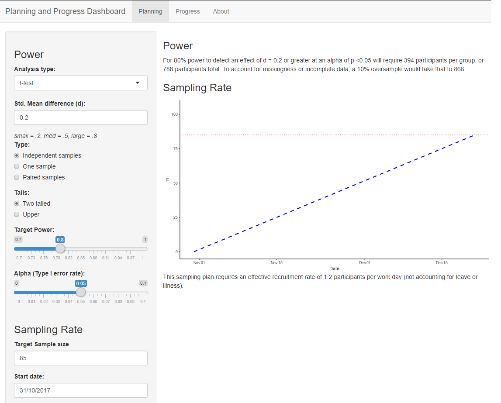

# Planning and Progress Dashboard

Good research takes good planning. Unfortunately, planning is tedious, perversely complex and therefore easy to neglect.

In response to these demands, we present the [Planning and progress dashboard](https://lingtax.shinyapps.io/PlanningProgressDashboard/).

Originally devised to prevent Mathew having to hand calculate timelines and to reduce the anti-social tapping out of power calculations in confirmation panels, this dashboard now provides non R programmers access to the power functions in the `pwr` package, and some in-built calculations to estimate timelines and recruitment rates. 
